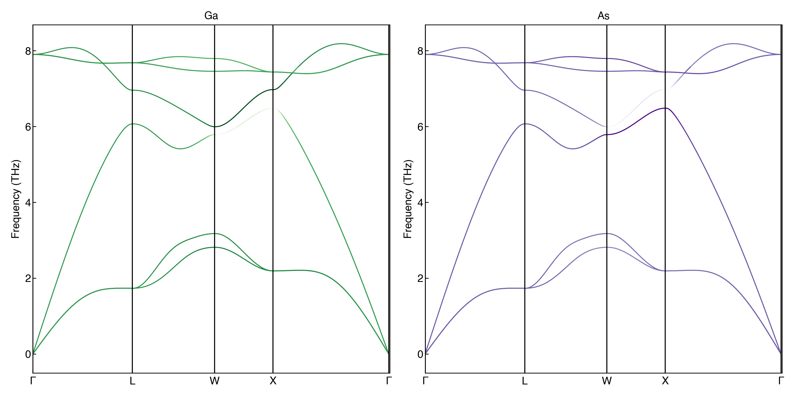

### phonon-dispersion-projections

____

** work in progress **

* plotting eigendisplacements of individual atoms onto a phonon dispersion

(plan is that this will eventually be forked into [https://github.com/SMTG-UCL/sumo](https://github.com/SMTG-UCL/sumo))

##### GaAs

##### ZnO

##### TODO + IDEAS
> * add linesegment plot in addition to scatter plot
> * multiprocess? larger systems are quite intensive but could just be memory issues...
> * identify different sites and plot those, i.e. Octahedral vs Tetrahedral?
> * plotting rotations vs displacements of polyhedra?

##### Example Calculation Details

* GaAs - VASP, PBEsol, Phonopy Finite Differences (4x4x4 supercell), ENCUT 400eV, KPOINTS = 8x8x8
* ZnO - VASP, PBEsol, DFPT, ENCUT = 500eV, KPOINTS = 8x8x4
